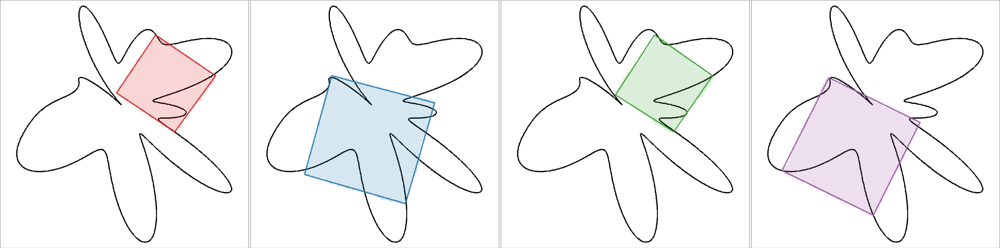

# Visual Diffusion Models are Geometric Solvers (CVPR 2026 Highlight)

> **Nir Goren\*, Shai Yehezkel\*, Omer Dahary, Andrey Voynov, Or Patashnik, Daniel Cohen-Or**
>
> In this paper we show that visual diffusion models can serve as effective geometric solvers: they can directly reason about geometric problems by working in pixel space. We first demonstrate this on the Inscribed Square Problem, a long-standing problem in geometry that asks whether every Jordan curve contains four points forming a square. We then extend the approach to two other well-known hard geometric problems: the Steiner Tree Problem and the Simple Polygon Problem.
> Our method treats each problem instance as an image and trains a standard visual diffusion model that transforms Gaussian noise into an image representing a valid approximate solution that closely matches the exact one. The model learns to transform noisy geometric structures into correct configurations, effectively recasting geometric reasoning as image generation.
> Unlike prior work that necessitates specialized architectures and domain-specific adaptations when applying diffusion to parametric geometric representations, we employ a standard visual diffusion model that operates on the visual representation of the problem. This simplicity highlights a surprising bridge between generative modeling and geometric problem solving. Beyond the specific problems studied here, our results point toward a broader paradigm: operating in image space provides a general and practical framework for approximating notoriously hard problems, and opens the door to tackling a far wider class of challenging geometric tasks.

<a href="https://kariander1.github.io/visual-geo-solver/"></a>
<a href="https://arxiv.org/abs/2510.21697"></a>

<p align="center">

</p>


## Environment Setup

### 1. **System Dependencies**
Install required build tools:
```bash
sudo apt-get update
sudo apt-get install build-essential libtool libtool-bin autotools-dev automake
```

### 2. **Python Environment**
Create a virtual environment and install dependencies with `uv`:
```
uv venv
uv sync
```
Activate the virtual environment:
```bash
source .venv/bin/activate
```

### 3. Training models
Run `./train.sh` providing the number of gpus to use and the config file name (without the .yaml extension):
```bash
./train.sh <num_gpus> <config_file>
```

### 4. Datasets and model checkpoints
The training and evaluation datasets used in the paper are available at https://huggingface.co/datasets/nirgoren/geometric-solver/tree/main. Download and extract the dataset under the `data` directory.

Trained model checkpoints from the paper are available at https://huggingface.co/nirgoren/geometric-solver/tree/main. Download and extract the checkpoints under the `model` directory.


### 5. Testing models

Run the evaluations scripts under the `eval_scripts` folder.

## Citation
If you use this code for your research, please cite the following work:
```
@misc{goren2025visualdiffusionmodelsgeometric,
      title={Visual Diffusion Models are Geometric Solvers},
      author={Nir Goren and Shai Yehezkel and Omer Dahary and Andrey Voynov and Or Patashnik and Daniel Cohen-Or},
      year={2025},
      eprint={2510.21697},
      archivePrefix={arXiv},
      primaryClass={cs.CV},
      url={https://arxiv.org/abs/2510.21697},
}
